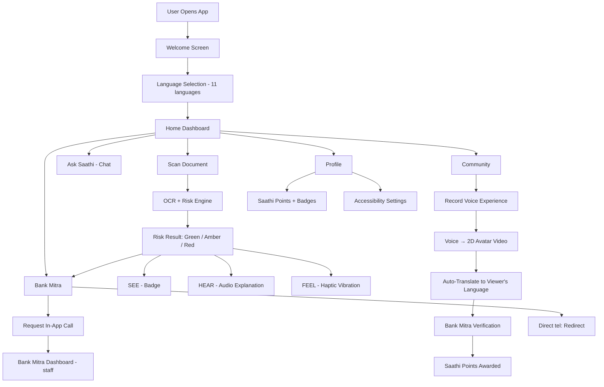

# SunoSaathii — Working Prototype
# SunoSaathii

AI-powered financial safety companion for low-literacy, first-time, and rural/semi-urban users — helps people understand financial documents before they sign.

## Features

- **Document Risk Scan** — scan/upload a loan or financial document, get OCR + rule-based risk analysis with a 🟢 Low / 🟡 Caution / 🔴 High Risk verdict
- **Multi-language support** — 11 Indian languages, selected at onboarding and applied across the entire app
- **Saathi (AI companion)** — animated 2D avatar that explains results by voice, with expression changes based on risk level
- **Tri-sensory alerts** — visual badge + audio explanation + haptic vibration pattern for each risk level
- **Community Voice Experiences** — users record real experiences in their own language; auto-translated and rendered as short 2D avatar videos for other users, with a verification workflow
- **Bank Mitra** — connects users to a real, verified human via in-app call request or direct phone dialer redirect
- **Saathi Points & badges** — non-monetary rewards for verified, helpful community contributions
- **Accessibility Suite** — high contrast mode, large text, voice navigation, haptic pattern testing
- **Demo Mode** — Safe / Caution / High-Risk sample documents to try the full flow instantly

## Architecture
# SunoSaathi — Architecture

## Overview

SunoSaathi is a single-page React application. There's no backend yet — all data (documents, community feed, Bank Mitra profile) is structured mock data designed to mirror what a real API/database would return, so the mock layer can be swapped for real services without touching the UI.

## System Flow



## Component Architecture

```mermaid
graph LR
    App["App.jsx (root)"] --> State["screen state (routing)"]
    App --> Shell["Shell + BottomNav"]

    Shell --> Home
    Shell --> Scan
    Shell --> Community
    Shell --> SaathiChat
    Shell --> Profile

    Scan --> Processing --> Result
    Result --> BankMitra
    Community --> BankMitraDashboard

    subgraph Shared Components
        PersonAvatar
        Badge
        VerifiedBadge
        Card
        PrimaryButton
        HapticViz
    end

    subgraph Data Layer - mock, swappable
        STR["STR - language strings"]
        DOCS["DOCS - risk documents"]
        COMMUNITY["COMMUNITY - voice experiences"]
        MITRA["MITRA - Bank Mitra profile"]
    end

    Home -.-> STR
    Result -.-> DOCS
    Community -.-> COMMUNITY
    BankMitra -.-> MITRA
```

## Tech Stack

| Layer | Technology |
|---|---|
| UI Framework | React (function components + hooks) |
| Styling | Tailwind CSS |
| Icons | lucide-react |
| Routing | Local `screen` state (no router library) |
| State | React `useState` / `useEffect`, per-screen |
| Backend | None yet — mock data layer |
| Build | Vite |

## Folder Structure

```
sunosaathi/
├── src/
│   ├── App.jsx          # entire app: components, screens, mock data
│   ├── main.jsx         # React entry point
│   └── index.css        # Tailwind imports
├── index.html
├── package.json
├── vite.config.js
├── tailwind.config.js
└── postcss.config.js
```

## Design Decisions

- **No router library** — screens are swapped via a single `screen` state variable (`go(next)`), since the app is a linear, mobile-first flow rather than a multi-route site.
- **Mock service layer** — all "AI" outputs (OCR, risk scoring, translation, voice-to-video) are pre-built JS objects/functions, structured so real APIs (OCR, STT, translation, TTS) can be dropped in behind the same function names (`analyzeDocument()`, `translateText()`, etc.) later.
- **Single-file component tree** — kept in one `App.jsx` for prototype portability (drop into Lovable/Bolt/Replit); can be split into `/components`, `/screens`, `/data` folders as the codebase grows.

## Future / Real Integration Points

| Mock today | Replace with |
|---|---|
| `DOCS` object | OCR + financial risk-extraction API |
| `STR` translations (non-hi/en deep content) | Real translation API (Bhashini / Google Translate) |
| Voice → video conversion | Speech-to-text + TTS + 2D avatar generation service |
| `tel:` redirect | Telephony/VoIP integration (Twilio, Exotel) |
| Bank Mitra call flow | Real-time call routing backend |
| Community feed | Database (Postgres/Firebase) + moderation queue |

An inclusive AI-powered financial safety companion prototype (React + Tailwind).

## Run locally

```bash
npm install
npm run dev
```

Then open the printed local URL (typically http://localhost:5173).

## Build

```bash
npm run build
npm run preview
```

## What's inside

- `src/App.jsx` — the full app: onboarding, language selection, home dashboard,
  document scan (with Safe / Caution / High-Risk demo buttons), OCR + risk analysis
  simulation, traffic-light result with Saathi avatar + haptic + audio explanation,
  Community voice experiences (with mock translation + verification), Ask Saathi chat,
  Bank Mitra request + staff dashboard, Accessibility settings, Profile with Saathi
  Points, and a closing pitch screen.

## Notes on scope

- Hindi and English strings are fully written out; other languages are selectable
  and clearly labelled as mock-translated for this prototype — swap in a real
  translation/OCR/speech API later via the same data layer.
- Haptic feedback uses the real Web Vibration API when opened on a supported device.
